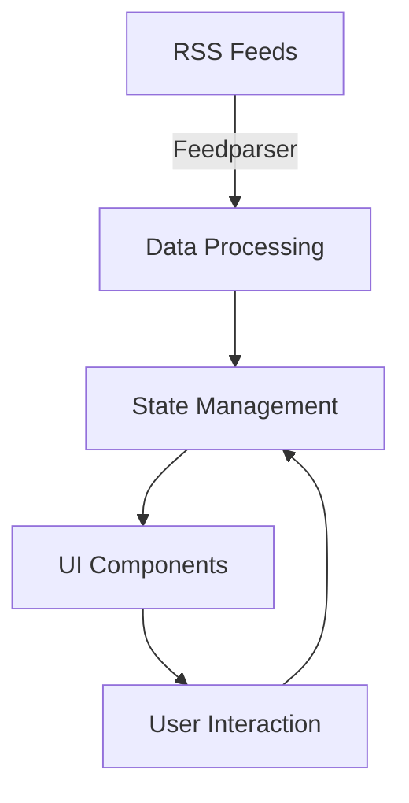

# 📰 News Feed Application (Portfolio Project)

A demonstration project showcasing a modern, responsive web application built with Streamlit and Python. This portfolio project aggregates news from various sources using RSS feeds to demonstrate full-stack development capabilities.

> **Note**: This is a portfolio project created for demonstration purposes only. It is not intended for commercial use. All news content belongs to their respective owners and is used here solely to showcase technical implementation.


## 🎯 Project Purpose

This portfolio project was created to demonstrate:

- **Full-Stack Development Skills**
  - Frontend development with Streamlit
  - Backend data processing and RSS feed handling
  - Responsive design implementation
  - State management and data flow

- **Technical Capabilities**
  - Python programming
  - API integration
  - Data processing
  - User interface design
  - Mobile-first approach

- **Best Practices**
  - Clean code architecture
  - Modern UI/UX principles
  - Responsive design patterns
  - Error handling
  - Code documentation

## �� Features

### Core Functionality
- **Multi-source News Aggregation**: Collects news from multiple trusted Turkish news sources
- **Category-based Organization**: News sorted into categories (General, Economy, Sports, Technology, Entertainment)
- **Advanced Filtering System**: Filter news by date, source, and content
- **Favorite System**: Save and manage your favorite news articles
- **Search Functionality**: Full-text search across all news articles

### Technical Features
- **Responsive Design**: Optimized for both desktop and mobile devices
- **Real-time Updates**: Fresh news content through RSS feeds
- **Session Management**: Persistent favorites across sessions
- **Efficient Data Handling**: Optimized news fetching and caching
- **Clean Architecture**: Well-organized, maintainable code structure

### UI/UX Features
- **Modern Interface**: Clean, intuitive user interface
- **Adaptive Layout**: Automatically adjusts based on screen size
- **Interactive Elements**: Hover effects and smooth transitions
- **Accessibility**: Readable typography and good contrast ratios
- **Loading States**: Clear loading indicators for better UX

## 📋 Supported News Sources

### General News
- Hürriyet
- Milliyet
- TRT Haber
- NTV
- Sözcü

### Economy
- Hürriyet Economy
- Dünya Newspaper
- TRT Economy

### Sports
- TRT Sports
- Fanatik
- HaberTürk Sports

### Technology
- DonanımHaber
- Webtekno
- Webrazzi
- ShiftDelete

### Entertainment
- Milliyet Magazine
- Sözcü Magazine

## 🚀 Installation

### Prerequisites
- Python 3.7 or higher
- pip (Python package manager)

### Step-by-step Installation

1. Clone the repository:
```bash
git clone https://github.com/yourusername/news-feed-app.git
cd news-feed-app
```

2. Create a virtual environment (recommended):
```bash
python -m venv venv
source venv/bin/activate  # On Windows: venv\Scripts\activate
```

3. Install required packages:
```bash
pip install -r requirements.txt
```

4. Run the application:
```bash
streamlit run app.py
```

## 💻 Usage Guide

### Basic Usage
1. **Select Categories**: Choose news categories you're interested in
2. **Choose Sources**: Select specific news sources within each category
3. **Apply Filters**: Use date filters to narrow down the news timeline
4. **Search**: Enter keywords to find specific news articles
5. **Save Favorites**: Click the star icon to save articles to favorites
6. **Switch Views**: Toggle between mobile and desktop layouts

### Advanced Features

#### Date Filtering
- **All**: Show all available news
- **Today**: Show only today's news
- **Last 3 Days**: Show news from the past three days
- **This Week**: Show news from the current week

#### Search Capabilities
- Multiple keyword search
- Case-insensitive matching
- Searches both titles and content

#### Favorites Management
- Persistent storage across sessions
- Easy access through sidebar
- One-click addition/removal

## 🔧 Customization

### Theme Customization
Modify the CSS variables in `app.py` to change the application's appearance:

```css
:root {
    --primary-color: #1E88E5;
    --background-color: #f8f9fa;
    --card-background: #ffffff;
    --text-color: #2c3e50;
}
```

### Layout Customization
- Adjust column layouts
- Modify card designs
- Change typography settings
- Customize animation effects

## 📱 Responsive Design

### Mobile View
- Single column layout
- Touch-friendly buttons
- Optimized text sizes
- Simplified navigation
- Collapsible sections

### Desktop View
- Multi-column layout
- Hover effects
- Advanced filtering options
- Sidebar for favorites
- Extended feature set

## 🛠 Technical Details

### Architecture
- **Frontend**: Streamlit framework
- **Data Fetching**: RSS feed parsing with feedparser
- **State Management**: Streamlit session state
- **Styling**: Custom CSS with responsive design

### Performance Optimizations
- Efficient RSS feed parsing
- Smart caching mechanisms
- Optimized search algorithms
- Lazy loading of content

### Security Considerations
- Input sanitization
- Safe RSS feed handling
- Secure session management
- Protected against common vulnerabilities

## 🤝 Contributing

We welcome contributions! Here's how you can help:

1. Fork the repository
2. Create a feature branch:
```bash
git checkout -b feature/AmazingFeature
```
3. Commit your changes:
```bash
git commit -m 'Add some AmazingFeature'
```
4. Push to the branch:
```bash
git push origin feature/AmazingFeature
```
5. Open a Pull Request

### Development Guidelines
- Follow PEP 8 style guide
- Add comments for complex logic
- Update documentation
- Include tests when possible

## 📝 License

This project is licensed under the MIT License - see the [LICENSE](LICENSE) file for details.

## 🐛 Known Issues

- Some RSS feeds might have delayed updates
- Session state resets on server restart
- Limited historical news availability

## 🔜 Roadmap

- [ ] Add more news sources
- [ ] Implement news categorization AI
- [ ] Add user authentication
- [ ] Enable news sharing
- [ ] Add notification system

## 🙏 Acknowledgments

- Streamlit team for the amazing framework
- All news sources for their RSS feeds
- Contributors and users of the application

## 📞 Support

For support, please:
- Open an issue
- Check existing documentation
- Review closed issues before opening new ones

## 💡 Tips

- Use the search function for specific topics
- Save frequently accessed filters
- Check the sidebar for saved articles
- Toggle between views for optimal experience

## 💡 Technical Implementation

### Architecture Overview


### Key Technical Aspects
- **RSS Feed Handling**: Implementation of RSS feed parsing and data extraction
- **State Management**: Session state handling in Streamlit
- **Responsive Design**: CSS implementation for various screen sizes
- **Search Algorithm**: Implementation of efficient search functionality
- **Data Filtering**: Category and date-based filtering system

## 📚 Learning Outcomes

This project helped develop skills in:
- Working with RSS feeds and data processing
- Building responsive web interfaces
- Implementing search and filtering functionality
- Managing application state
- Writing clean, maintainable code
- Documenting code and features

## ⚠️ Disclaimer

This is a portfolio project created for demonstration purposes only. All news content is sourced from publicly available RSS feeds and belongs to their respective owners. This project is not intended for commercial use or distribution.

## 📫 Contact

For any questions about this portfolio project or job opportunities, please reach out:

- GitHub: [Your GitHub]
- LinkedIn: [Your LinkedIn]
- Email: [Your Email]

---

Made with ❤️ as a portfolio project to showcase full-stack development skills 